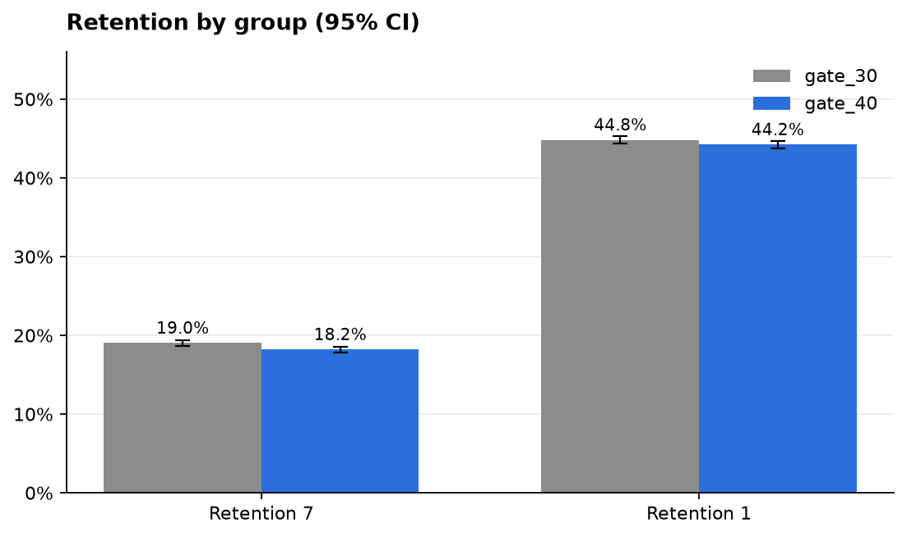

# Cookie Cats: Should the First Gate Move to Level 40?

[](https://github.com/kaveenseneviratne/game-retention-ab-test/actions/workflows/ci.yml)


A reproducible analysis of a 90,189-player A/B test in the mobile puzzle game *Cookie Cats*.
The test moved the first progression gate (where players must wait or pay to continue) from
level 30 to level 40. This project answers one question: **did that change hurt player retention?**

**Recommendation: keep the gate at level 30.** Moving it to level 40 cut 7-day retention by
0.82 pp (19.02% → 18.20%, 95% CI −1.33 to −0.31 pp, p = 0.002): about 8 fewer players per 1,000
still playing.
Full reasoning in the [decision memo](docs/decision_memo.md).



## Results at a glance

| Metric | Role | gate_30 | gate_40 | Difference (95% CI) | p-value |
|---|---|---|---|---|---|
| 7-day retention | Primary | 19.02% | 18.20% | **−0.82 pp** (−1.33 to −0.31) | 0.002 |
| 1-day retention | Secondary | 44.82% | 44.23% | −0.59 pp (−1.24 to +0.06) | 0.074 (Holm) |
| Game rounds (median) | Guardrail | 17 | 16 | −1 (bootstrap CI −1 to 0) | 0.050 (Mann-Whitney, r = −0.008) |

## Approach

The analysis plan was written in [`config/experiment.yaml`](config/experiment.yaml) **before**
looking at any outcomes: primary metric, guardrail, significance level and outlier rule.

1. **Data validation.** Schema, nulls, duplicate users and group labels are checked; the run
   fails loudly on anything unexpected.
2. **Sample ratio mismatch check.** A chi-square test confirms the traffic split matches the
   design before any effect is trusted.
3. **Power analysis.** Computes the minimum detectable effect, so a null result can be read
   correctly instead of being taken as "no effect".
4. **Frequentist tests.** Two-proportion z-test with Wald CIs for retention, Holm correction
   on secondary metrics, Mann-Whitney U for the heavily skewed guardrail.
5. **Robustness checks.** Bootstrap CIs (10,000 resamples) and a Beta-Binomial Bayesian
   comparison reporting P(treatment better) and expected loss.
6. **Decision rules.** Encoded in code, so the recommendation follows from the plan rather
   than from how the results look.

## Project structure

```
├── config/experiment.yaml     # pre-registered analysis plan
├── src/abtest/
│   ├── config.py              # typed, validated config
│   ├── data.py                # loading, schema validation, outlier capping
│   ├── quality.py             # sample ratio mismatch check
│   ├── power.py               # MDE and sample size
│   ├── frequentist.py         # z-test, Holm correction, Mann-Whitney U
│   ├── bootstrap.py           # bootstrap CIs
│   ├── bayesian.py            # Beta-Binomial comparison
│   ├── decision.py            # recommendation rules
│   ├── plots.py               # figures
│   ├── pipeline.py            # orchestration
│   ├── report.py              # JSON + Markdown outputs
│   └── cli.py                 # `abtest run`
├── tests/                     # pytest suite on synthetic data with known effects
└── docs/                      # decision memo and README images
```

## Reproduce it

Requires Python 3.11+.

```bash
git clone https://github.com/kaveenseneviratne/game-retention-ab-test.git
cd game-retention-ab-test
python -m venv .venv && source .venv/bin/activate   # Windows: .venv\Scripts\activate
make install
```

Download `cookie_cats.csv` from
[Kaggle](https://www.kaggle.com/datasets/yufengsui/mobile-games-ab-testing) into `data/raw/`, then:

```bash
make analyse   # writes reports/results.json, reports/summary.md and reports/figures/
make check     # lint, type checks and tests, same as CI
```

## Limitations

- **Short horizon.** Retention is measured at 1 and 7 days; long-term effects aren't observed.
- **No monetisation data.** The gate also drives in-app purchases, which this data can't measure.
- **Traffic split.** gate_40 received 789 more players (50.4% vs 49.6%). This passes the
  pre-registered SRM threshold (p = 0.009 against α = 0.001) but is flagged in the memo.

## Tech

Python · pandas · NumPy · SciPy · statsmodels · Matplotlib · pytest · ruff · mypy · GitHub Actions
